# Classical Machine Learning for Tweet Classification

This project presents a robust pipeline for tweet classification using classical machine learning. The approach demonstrates practices in data preprocessing, feature engineering, model selection, hyperparameter optimization, and evaluation, with a focus on reproducibility and scalability.

---

## 1. Business Problem and Dataset Overview

The objective is to accurately classify tweets into predefined categories, leveraging advanced text vectorization and feature engineering. The dataset consists of real-world tweets, presenting challenges such as noise, informal language, and class imbalance—typical in social media analytics and customer sentiment applications.

---

## 2. Vectorizer Selection and Tuning

Three vectorization strategies were benchmarked using multinomial logistic regression:

- **CountVectorizer**: Standard bag-of-words representation
- **TF-IDF Vectorizer**: Term frequency-inverse document frequency
- **HashingVectorizer**: Memory-efficient, dictionary-free approach

Initial results indicated overfitting, as visualized below:

| CountVectorizer | TF-IDF Vectorizer | HashingVectorizer |
|:--------------:|:----------------:|:-----------------:|
| 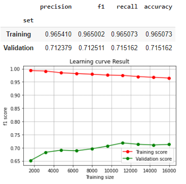 | 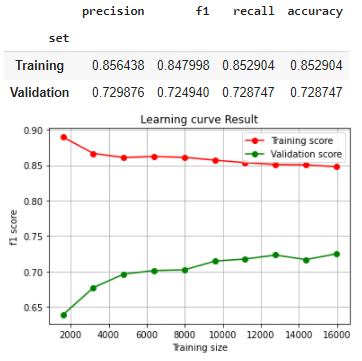 | 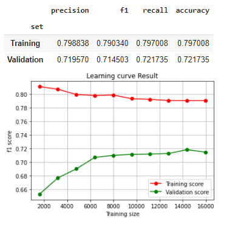 |

---

Parameter optimization was performed to reduce noise and mitigate overfitting:
- **min_df, max_df**: 0.01 and 0.4 to filter rare and frequent terms
- **ngram_range**: (1,5) to capture multi-word expressions

| CountVectorizer | TF-IDF Vectorizer | HashingVectorizer |
|:--------------:|:----------------:|:-----------------:|
| 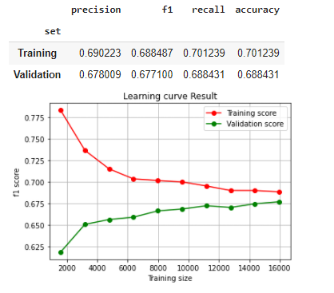 | 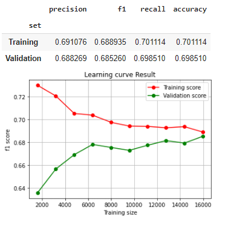 | 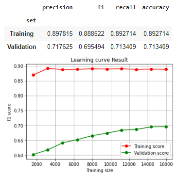 |

Additional parameter sweeps were conducted, with minimal impact on performance:
- `TfidfVectorizer(min_df=0.01, max_df=0.99, ngram_range=(1,5), max_features=1000, smooth_idf=True, norm='l2', sublinear_tf=True, use_idf=False)`
- `TfidfVectorizer(norm='l2', use_idf=True, smooth_idf=False, sublinear_tf=True, lowercase=True)`
- `CountVectorizer(min_df=0.01, max_df=0.4, ngram_range=(1,5), max_features=1000)`
- `CountVectorizer(lowercase=True, stop_words='english', min_df=0.2, binary=False)`
- `CountVectorizer(lowercase=False, stop_words='english', binary=False)`
- `CountVectorizer(lowercase=True, stop_words='english', binary=False, ngram_range=(1,2))`
- `HashingVectorizer(n_features=2**12)`

---

## 3. Data Preprocessing Pipeline

A modular preprocessing pipeline was implemented, including:

1. Removal of URLs (http/bit.ly)
2. Removal of non-alphanumeric characters
3. Lowercasing
4. Lemmatization
5. Stop word removal
6. Hashtag and mention removal

Optimal configuration: **{1,3,4,5}**

| CountVectorizer | TF-IDF Vectorizer |
|:--------------:|:----------------:|
| 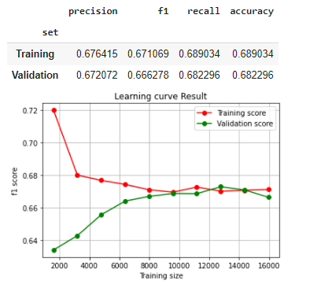 | 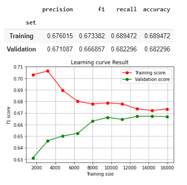 |

---

## 4. Feature Engineering

Domain-specific and statistical features were engineered to enhance model expressiveness:

- Character and word counts
- Uppercase and punctuation statistics
- Hashtag and mention counts
- Stop word and unique word frequencies
- Average word length
- Part-of-speech frequencies (nouns, adjectives, verbs, adverbs)

Best combination: **{unique word freq, stop word freq, avg word length, POS frequencies}**

| CountVectorizer | TF-IDF Vectorizer |
|:--------------:|:----------------:|
| 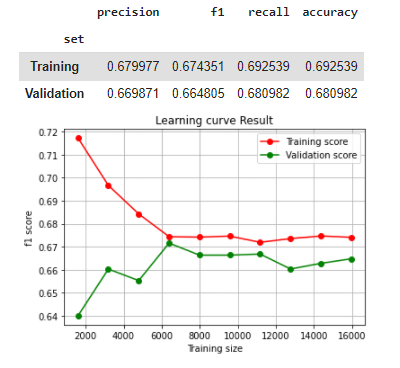 | 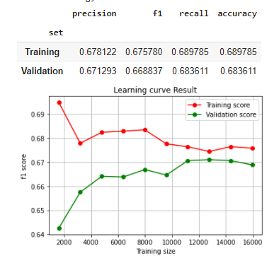 |

---

### 4.1 Dimensionality Reduction

PCA was evaluated for dimensionality reduction. Due to the already compact feature space, further reduction degraded performance and was not adopted in production.

| CountVectorizer | TF-IDF Vectorizer |
|:--------------:|:----------------:|
| 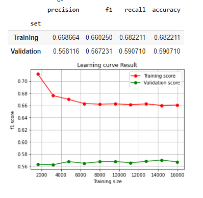 | 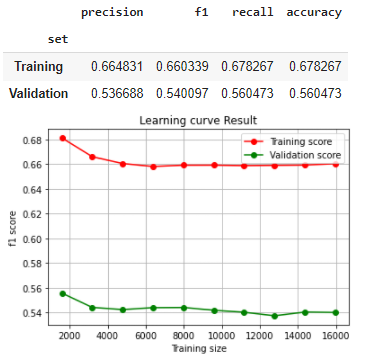 |

---

## 5. Model Selection and Optimization

A multinomial logistic regression (softmax) classifier was selected for its interpretability and scalability. Hyperparameters were tuned via GridSearchCV:

- **Penalty:** l2 (best), l1, elasticnet
- **C (regularization):** 100 (TF-IDF), 0.1 (CountVectorizer)
- **Solver:** newton-cg (best), lbfgs, saga, sag

| CountVectorizer | TF-IDF Vectorizer |
|:--------------:|:----------------:|
| 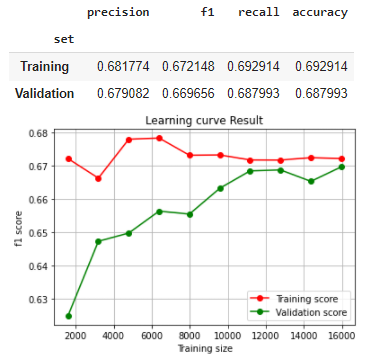 | 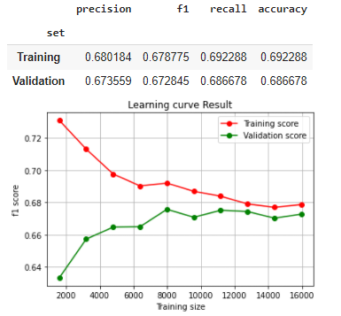 |

---

## 6. Final Model Pipeline

- **Preprocessing:**
  - URL removal, lowercasing, lemmatization, stop word removal
- **Feature Engineering:**
  - Unique word frequency, stop word frequency, average word length, POS frequencies
- **Vectorizer:**
  - TF-IDF Vectorizer
- **Classifier:**
  - Multinomial logistic regression (softmax)
  - C: 100, Solver: newton-cg, Penalty: l2

### Results

The final model, with optimized hyperparameters and engineered features, achieved strong performance on the tweet classification task. For detailed metrics and plots, see the accompanying notebook.

| TF-IDF Vectorizer (Softmax Regression) |
|:--------------------------------------:|
|  |

---

## 7. Utilities

Reusable utility functions were developed to support the pipeline:

- **freq_pos:** Adds POS frequency columns (nouns, adjectives, verbs, adverbs)
- **get_scores:** Computes precision, recall, f1, and accuracy for train/validation
- **f1_learning_curve:** Generates learning curves using scikit-learn ([docs](https://scikit-learn.org/stable/auto_examples/model_selection/plot_learning_curve.html#sphx-glr-auto-examples-model-selection-plot-learning-curve-py))
- **display_false_predictions:** Outputs misclassified examples for error analysis

---

**For further technical details, code, and reproducible experiments, please refer to the accompanying Jupyter notebook.**
