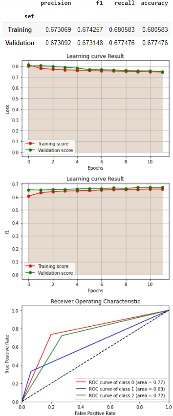
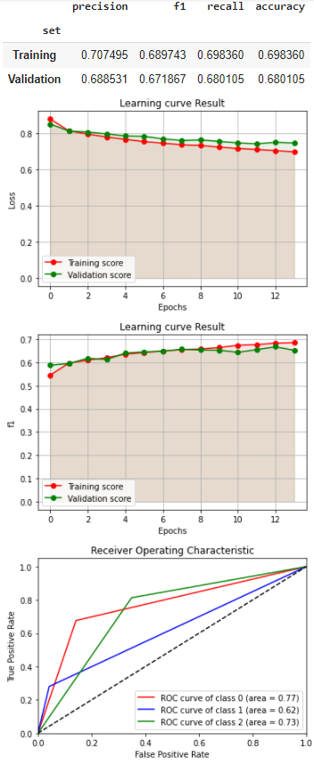
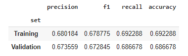
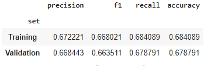
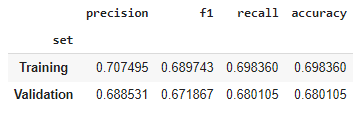

# Deep Learning Model Design and Evaluation for Tweet Classification

This document presents an analysis and evaluation of deep learning models for tweet classification, focusing on robust preprocessing, architecture selection, loss functions, optimization, and comparative results.

---

## Data Preprocessing Strategy

A range of preprocessing methods were evaluated:
- Removal of links
- Removal of hashtags
- Removal of mentions
- Replacement of links with `<link>`
- Replacement of hashtags with `<hashtag>`
- Replacement of mentions with `<mention>`
- Replacement of numbers with `<number>`
- Replacement of uppercase characters with `<upper>`
- Retaining only alphanumeric characters
- Conversion to lowercase
- Lemmatization
- Removal of stop words

> Note: Methods 4–8 were designed to support entity vectorization for GloVe Twitter pretrained embeddings, but were not used in the final models as these embeddings were not ultimately adopted.

After extensive evaluation, the optimal preprocessing steps were conversion to lowercase, lemmatization, and stop word removal. Punctuation and entity replacement did not improve results for these datasets and models.

---

## Model Architecture: Hidden Layers and Units

- Initial tests with no hidden layers yielded an f1 score of 0.45.
- Adding a hidden layer and increasing its units improved results.
- Excessive units in the first hidden layer slowed training and plateaued metrics.
- Introducing a second hidden layer and redistributing units increased model complexity and performance, until overfitting appeared.
- The final architecture for both models uses two hidden layers: `[1024, 512]` and `[512, 3]`, balancing performance and generalization.

---

## Loss Function Selection

- Both models were evaluated with **Cross Entropy** and **Negative Log Likelihood** loss functions, appropriate for multi-class classification.
- Regression losses (L1, MSE, etc.) were not considered, as they are not suitable for this task.

---

## Learning Rate Scheduling

- Multiple learning rates were tested. High rates led to fast but unstable convergence; low rates slowed training and sometimes degraded results.
- Learning rate schedulers (exponential decay with factor 0.9, step decay every 5 epochs by 0.1) were used to improve convergence and stability.

---

# Model 1: TF-IDF + Feedforward Neural Network

### Hyperparameter and Optimizer Experiments
- **Vectorizer:** TF-IDF (`min_df=0.01`, `max_df=0.4`, `ngram_range=(1,5)`)
- **SGD with Momentum=0.5:**
  - Loss: Cross Entropy
  - Activation: ReLU after each layer
  - Overfitting observed; dropout and L2 regularization (weight_decay) partially mitigated it
  - Activation functions tested: SELU, ELU, LeakyReLU, RRELU (all f1 ≈ 0.67)
- **NLLLoss:**
  - Added softmax activation
  - Vanishing gradients addressed with batch normalization
  - Momentum values tested: 0.9, 0.7, 0.3 (f1 ≈ 0.66–0.67)
- **Other optimizers:**
  - Nesterov momentum, Adagrad, Adam, Adamax, Nadam, RMSprop (various regularization and dropout settings, f1 up to 0.69)

### Final Model 1 Configuration
- Layers: `[input, 1024]`, `[1024, 512]`, `[512, 3]`
- Activation: ELU + Dropout
- Loss: Cross Entropy
- Optimizer: SGD with Momentum
- LR Scheduler: Exponential decay
- Vectorizer: TF-IDF
- Batch size: 32
- Epochs: 12

---

## Pre-Trained Embeddings: GloVe

- Twitter GloVe (25, 50, 100, 200 dims) and standard GloVe (50, 100, 200, 300 dims) were evaluated.
- Best results with GloVe 300d. Helper functions (`check_model`, `check_model2`) were used to audit token coverage.

---

# Model 2: GloVe Embeddings + Feedforward Neural Network

### Hyperparameter and Optimizer Experiments
- **Vectorizer:** GloVe pre-trained embeddings (300d, tweet represented by mean of token vectors)
- **SGD, ReLU, Cross Entropy:** Overfitting observed; L2 regularization and dropout (0.6–0.75) tested
- **Activation functions:**
  - ReLU (f1=0.69), SELU (vanishing gradients, overfit), ELU (f1=0.67, stable)
- **Optimizers:**
  - Nesterov momentum (f1=0.68), Adagrad (f1=0.65–0.68), RMSprop (f1=0.67), Adam (f1=0.68), Adamax (f1=0.69), Nadam (f1=0.65–0.63)
  - Dropout and L2 regularization were key to controlling overfitting

### Final Model 2 Configuration
- Layers: `[input, 1024]`, `[1024, 512]`, `[512, 3]`
- Activation: LeakyReLU + Dropout
- Loss: Cross Entropy
- Optimizer: SGD with Momentum
- Regularizer: L2 (`weight_decay=1e-3`)
- LR Scheduler: Exponential decay
- Vectorizer: GloVe 300d
- Batch size: 32
- Epochs: 14

---

## Comparative Results

The following figures illustrate the performance of both models:

|  |  |
|:----------------------:|:----------------------:|
| **Model 1** | **Model 2** |

Both models demonstrate strong convergence, effective overfitting control, and robust ROC curve characteristics. Training is stopped at the optimal point to avoid cost divergence or metric stagnation. True positive rates are consistently high, and ROC curves approach the ideal top-left corner. Class 1 performance is lower, as expected, due to class imbalance (15% of data).

### Comparison with Multinomial Logistic Regression

Both deep models achieve results comparable to multinomial logistic regression from the previous study:

|  |  |  |
|:-------------------------------:|:----------------------:|:----------------------:|
| **Multinomial Logistic Regression** | **Model 1** | **Model 2** |

> **Insight:** While neural networks are more complex, they do not always outperform simpler models for this problem. Factors include:
> - Averaging word embeddings may not capture tweet semantics as well as sequence models.
> - The problem may be better suited to either simpler (logistic regression) or more complex (RNN) architectures.