# Artificial Intelligence 2 – Assignment 3

**Author:** Konstantinos Dimitrakopoulos  
**ID:** 1115201500034

---

## Contents
- [Data Preprocessing](#data-preprocessing)
- [Multi-Layer LSTM Networks](#multi-layer-lstm-networks)
- [Multi-Layer GRU Networks](#multi-layer-gru-networks)
- [Combined Multi-Layer LSTM-GRU Networks](#combined-multi-layer-lstm-gru-networks)
- [Individual LSTM-GRU Networks with Skip Layers](#individual-lstm-gru-networks-with-skip-layers)
- [Combined LSTM-GRU Networks with Skip Layers](#combined-lstm-gru-networks-with-skip-layers)
- [Best Model Optimization](#best-model-optimization)
- [Adding Attention](#adding-attention)
- [The Final Model](#the-final-model)
- [Comparison with the Corresponding DNN Model](#comparison-with-the-corresponding-dnn-model)

---

## Data Preprocessing

The data undergo preprocessing for optimal alignment during vectorization. The following methods were tested:

1. Removal of links
2. Removal of hashtags
3. Removal of mentions
4. Replacement of links with `<link>`
5. Replacement of hashtags with `<hashtag>`
6. Replacement of mentions with `<mention>`
7. Replacement of numbers with `<number>`
8. Replacement of uppercase characters with `<upper>`
9. Retaining only alphanumeric characters
10. Conversion to lowercase
11. Lemmatizing
12. Removal of stop words

For token-embedding alignment, experiments were conducted with the pre-trained embeddings **glove.twitter.26B** and **glove.6B**. Methods 4 to 8 contribute to the vectorization of entities as described within the GloVe Twitter pretrained embeddings.

---

## Experiments with the GloVe 6B Set

Using the helper function `token_statistics`, the following table summarizes the characteristics for different preprocessing combinations. Specifically, it lists:
- Total number of tokens produced by the tokenizer
- Total number of tokens found in the pretrained embeddings dictionary
- Total number of tokens not found
- Percentage coverage of total tokens by the dictionary
- Comments for each test

| No | Modules | Total | Found | Not Found | % Coverage | Comments |
|----|---------|-------|-------|-----------|------------|----------|
| P1 | remove_non_alpha, to_lowercase, lemmatize, remove_stop_words | 210226 | 186094 | 24132 | 0.88 | Ignores joined, misspelled, and obscure tokens. E.g., “timehealth”, ”mncqnpdqgc”, “aaaaaa” |
| P2 | to_lowercase, lemmatize, remove_stop_words | 275535 | 245948 | 29587 | 0.89 | Ignores emoji, links, joined tokens, and numbers. |
| P3 | remove_links, remove_hashtags, remove_mentions, to_lowercase, lemmatize, remove_stop_words | 214250 | 204721 | 9529 | 0.95 | Ignores tokens using emoji, dashes, or are misspelled. |
| P4 | replace_links, replace_hashtags, replace_mentions, replace_numbers, replace_upper_words, to_lowercase, lemmatize, remove_stop_words | 250272 | 198291 | 51981 | 0.79 | Ignores transformation of special tokens as expected. |

**Observations:**
- Test P3 offers the best coverage from the dictionary and may be the best text representation, but test P2 offers more token matches and thus a larger representation than P3.
- Test P4, as expected, ignores the special tokens formed for the Twitter pretrained embeddings, so it may not be a good representation.
- All tests fail to recognize joined, misspelled, and obscure tokens.

---

## Experiments with the GloVe Twitter 26B Set

The same tests were conducted for the **glove.twitter.26B** set. The results table is presented below.

| No | Modules | Total | Found | Not Found | % Coverage | Comments |
|----|---------|-------|-------|-----------|------------|----------|
| P5 | remove_non_alpha, to_lowercase, lemmatize, remove_stop_words | 210226 | 188028 | 22198 | 0.89 | Ignores joined, misspelled, and obscure tokens. |
| P6 | to_lowercase, lemmatize, remove_stop_words | 275535 | 241178 | 34357 | 0.87 | Ignores emoji, links, joined tokens, and numbers. |
| P7 | remove_links, remove_hashtags, remove_mentions, to_lowercase, lemmatize, remove_stop_words | 214250 | 198881 | 15369 | 0.92 | Ignores tokens using emoji, dashes, or are misspelled. |
| P8 | replace_links, replace_hashtags, replace_mentions, replace_numbers, replace_upper_words, to_lowercase, lemmatize, remove_stop_words | 250272 | 239805 | 10467 | 0.95 | Ignores tokens using emoji, dashes, or are misspelled. Recognizes special tokens, offering good coverage from the dictionary. |

**Observations:**
- The total number of tokens is the same as in previous tests, but there are differences in dictionary coverage.
- As in previous tests, the experiments fail to recognize joined, misspelled, and obscure tokens.
- Test P8 recognizes special tokens, providing good coverage from the dictionary.

---

## Multi-Layer LSTM Networks

Experiments were conducted on multi-layer bidirectional LSTM networks. The table below summarizes these experiments, presenting the network scheme, gradient clipping norm (GC) if applied, dropout probability (DO) before each layer if applied, number of epochs (Ep), loss, f1 score, and comments regarding training.

| No | Scheme | GC | DO | Ep | Loss (Train/Val) | Score (Train/Val) | Comments |
|----|--------|----|----|----|------------------|-------------------|----------|
| 1 | LSTM (3) | - | - | 20 | 0.79587/0.84480 | 0.97222/0.97556 | Good model, slight overfitting, vanishing gradients observed. |
| 2 | LSTM (100), LSTM (50), LSTM (3) | - | 0.2 | 15 | 0.63665/0.58574 | 0.32497/0.33421 | Low f1, tends to converge, more epochs needed, good loss convergence, abrupt f1 changes, good model. |
| 3 | 2 -> + Batch Norm | - | 0.2 | 49 | 0.61188/0.60518 | 0.55838/0.54903 | Low f1, converges, more epochs, good convergence, abrupt f1 changes, good model. |
| 4 | LSTM (75), LSTM (3) | - | 0.2 | 20 | 0.84393/0.85413 | 0.61162/0.60835 | Good model. |
| 5 | LSTM (100, bid), LSTM (50, bid), LSTM (3) | - | 0.2 | 19 | 0.84309/0.85619 | 0.61719/0.60303 | Good model. |
| 6 | LSTM (80, bid), LSTM (3) | - | 0.2 | 20 | 0.80189/0.83620 | 0.65215/0.62294 | Good model. |
| 7 | LSTM (3) | - | 0.2 | 35 | 0.96514/0.96573 | 0.46894/0.47351 | Good model, permanent increase in loss, permanent decrease in f1, good convergence, good loss and f1, more epochs, unchanged, gradients up to 6-7, average f1 improvement 1-2%. |
| 8 | LSTM (3) | - | 0.2 | 49 | 0.94171/0.94435 | 0.50918/0.51350 | Good model, strong gradients. |
| 9 | LSTM (3) | 2 | 0.2 | 97 | 0.82404/0.83875 | 0.89549/0.89606 | Best model so far with gradient clipping. |

**Further Explanation of Scheme:**
- The scheme describes the number of layers, the size of the output features from each layer, and the bidirectional property of each layer.
- For example, experiment 7 presents a network where the first layer is a bidirectional LSTM layer with output size 80, and the second layer is an LSTM layer with output size 3.
- Experiment 3 is a variation of experiment 2 with batch normalization added.

**Generated diagrams:**

| Test 1                | Test 3                | Test 4                | Test 5                |
|-----------------------|-----------------------|-----------------------|-----------------------|
| 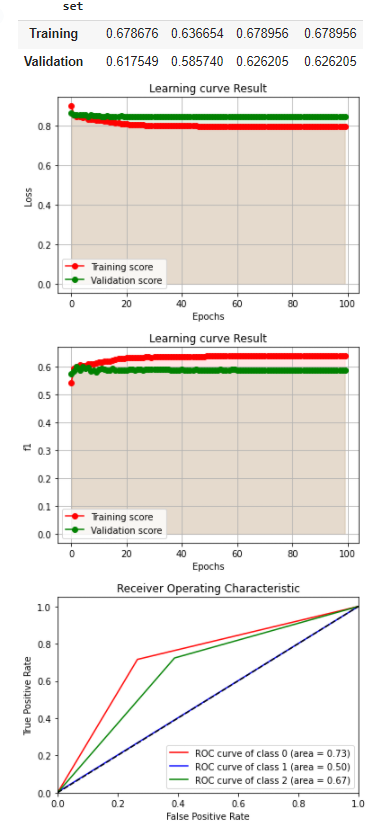   *Test 1* | 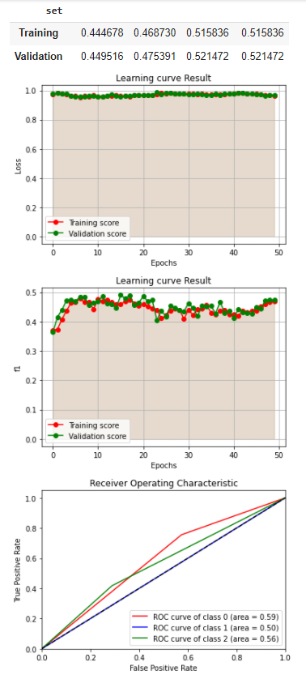   *Test 3* | 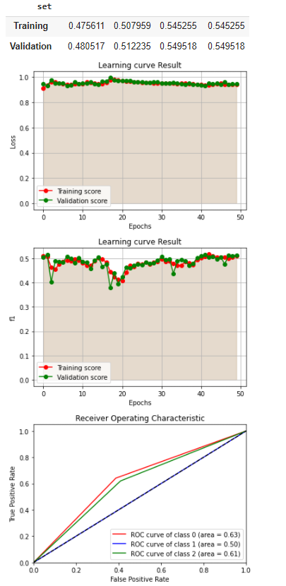   *Test 4* | 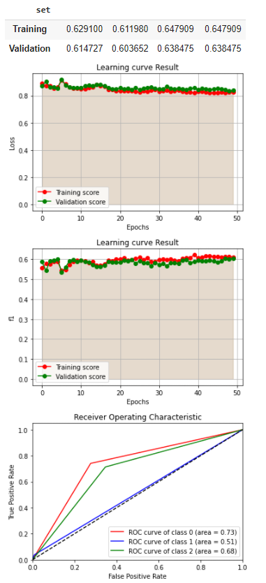   *Test 5* |
| Test 6                | Test 7                | Test 8                | Test 9                |
| 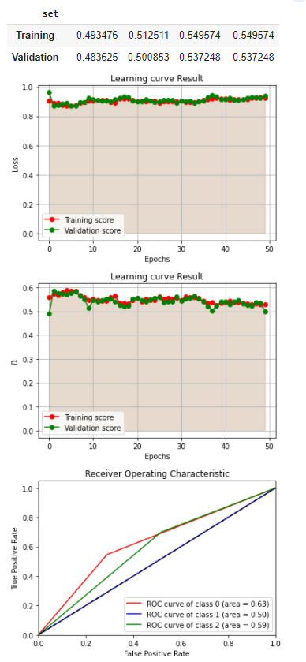   *Test 6* | 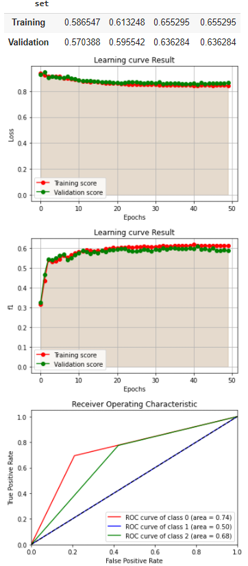   *Test 7* | 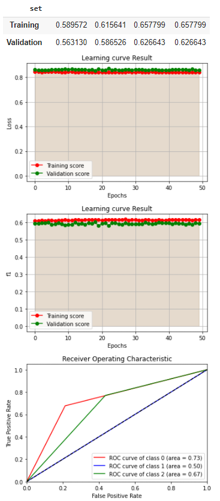   *Test 8* | 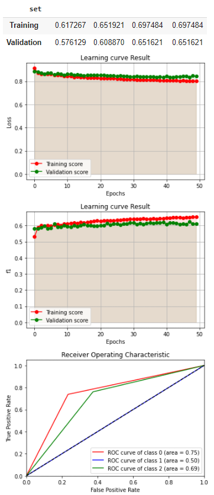   *Test 9*

---

## Multi-Layer GRU Networks

The same process was followed for multi-layer GRU networks. The results are summarized in the table below.

| No | Scheme | GC | DO | Loss (Train/Val) | Score (Train/Val) | Ep | Comments |
|----|--------|----|----|------------------|-------------------|----|----------|
| 10 | GRU (100, bid), GRU (50, bid), GRU (3) | 2 | 0.2 | 0.98223/0.9848 | 0.30288/0.30368 | 21 | Possible vanishing gradients, possible solution: layer skipping. |
| 11 | 10 -> + Batch Norm | 2 | 0.2 | 0.80373/0.83822 | 0.30294/0.30618 | 49 | Similar behavior, needs more epochs. |
| 12 | GRU (80, bid), GRU (3) | 2 | 0.2 | 0.79904/0.83229 | 0.77566/0.82418 | 35 | Good model, stable, needs more epochs. |
| 13 | 12 -> + epochs | 2 | 0.2 | 0.62133/0.60129 | 0.64550/0.62527 | 48 | Good model, abrupt changes in loss and f1 in epochs 3-7. |
| 14 | GRU (3) | 2 | 0.2 | 0.99197/0.99114 | 0.99197/0.99114 | 50 | Unchanged, good model. |

The vanishing gradients phenomenon appeared in test 10 and was not successfully addressed in test 11. Models 12 and 14 show good performance according to the metrics and are satisfactory. Ultimately, models using GRU layers are more time-efficient.

**Generated diagrams:**

| Test 12                | Test 13                | Test 14                |
|------------------------|------------------------|------------------------|
| 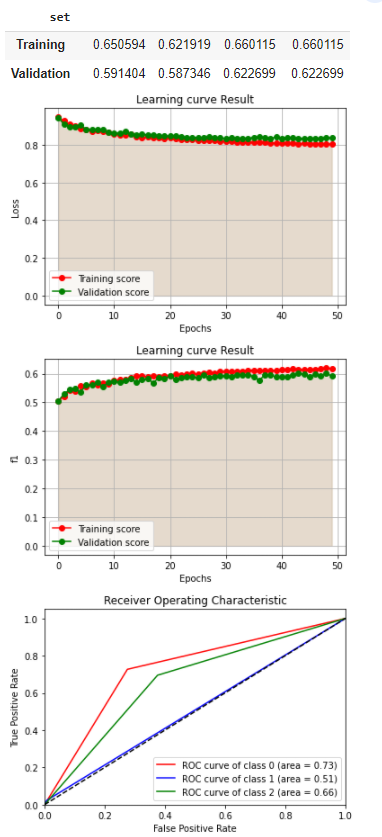   *Test 12* |    *Test 13* | 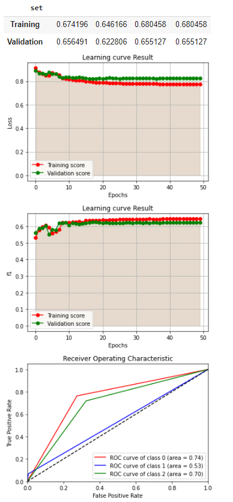   *Test

---

## Combined Multi-Layer LSTM-GRU Networks

The same process was followed for combined multi-layer LSTM-GRU networks. The results table is as follows:

| No | Scheme | GC | DO | Loss (Train/Val) | Score (Train/Val) | Ep | Comments |
|----|--------|----|----|------------------|-------------------|----|----------|
| 15 | LSTM (100, bid), GRU (50, bid), GRU (3) | 2 | 0.2 | 0.96533/0.97474 | 0.30264/0.30357 | 122 | Vanishing gradients. |
| 16 | 15 -> + Batch Norm | 2 | 0.2 | 0.97221/0.98104 | 0.45205/0.43837 | 36 | Low f1. |
| 17 | LSTM (100, bid), LSTM (50, bid), GRU (3) | 2 | 0.2 | 0.99186/0.99092 | 0.33748/0.35720 | 19 | Low f1, satisfactory training. |
| 18 | GRU (100, bid), GRU (50, bid), LSTM (3) | 2 | 0.2 | 0.86703/0.86879 | 0.5895/0.58651 | 33 | Good convergence, good model, initially intense changes. |
| 19 | 17 -> + Batch Norm | 2 | 0.2 | 0.93230/0.94422 | 0.30375/0.30732 | 113 | Vanishing gradients, highly variable. |
| 20 | 18 -> + Batch Norm | 2 | 0.2 | 0.83938/0.86450 | 0.6103/0.59364 | 46 | Good model, initially intense changes. |
| 21 | GRU (100, bid), LSTM (50, bid), LSTM (3) | 2 | 0.2 | 0.90307/0.9107 | 0.5530/0.55516 | 33 | Good model. |
| 22 | LSTM (80, bid), GRU (3) | 2 | 0.2 | 0.85375/0.8818 | 0.3130/0.3145 | 34 | Good convergence, poor f1, initially intense changes, vanishing gradients. |
| 23 | 22 -> + Batch Norm | 2 | 0.2 | 0.8278/0.8433 | 0.60052/0.59434 | 43 | Good convergence, good model, initially intense changes. |
| 24 | GRU (80, dim), LSTM (3) | 2 | 0.2 | 0.8278/0.8433 | 0.60052/0.59434 | 43 | Good convergence, good model, initially intense changes. |

**Notes:**
- Combining different types of layers does not improve metric performance.
- Vanishing gradients were addressed with batch normalization, but this further reduced metric performance.
- Ultimately, models from previous sections are preferred.

**Generated diagrams:**

| Test 18                | Test 21                | Test 22                | Test 23                | Test 24                |
|------------------------|------------------------|------------------------|------------------------|------------------------|
| 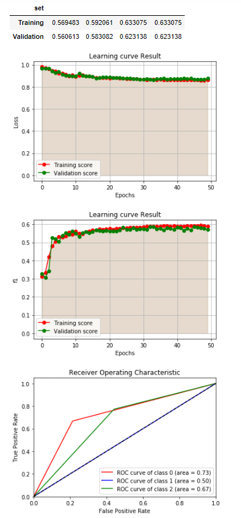   *Test 18* | 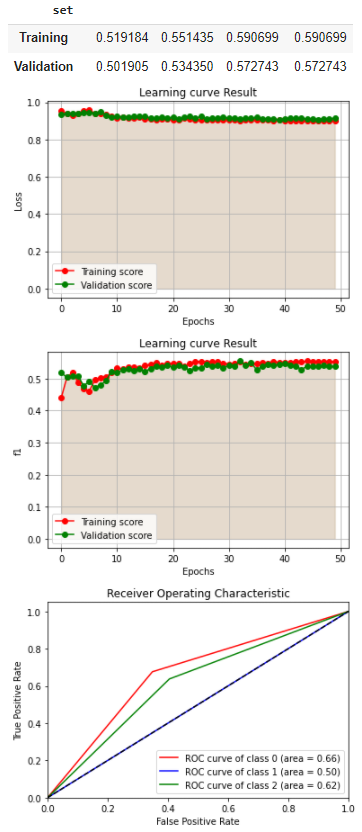   *Test 21* | 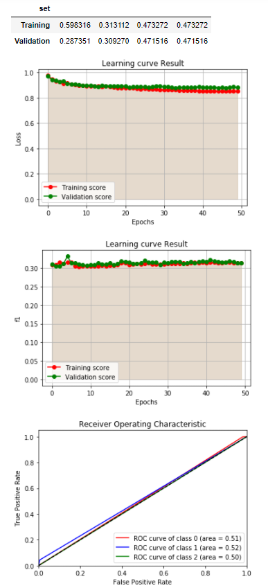   *Test 22* | 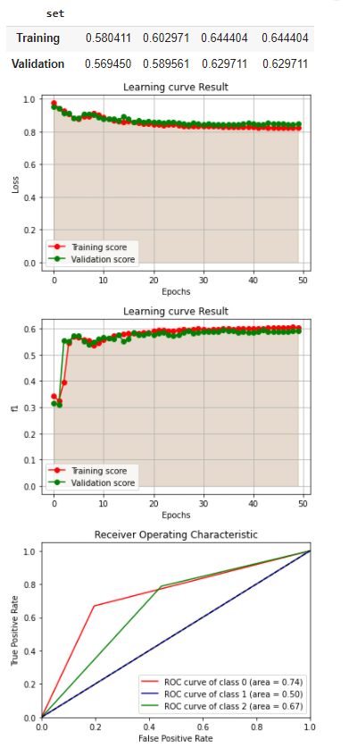   *Test 23* | 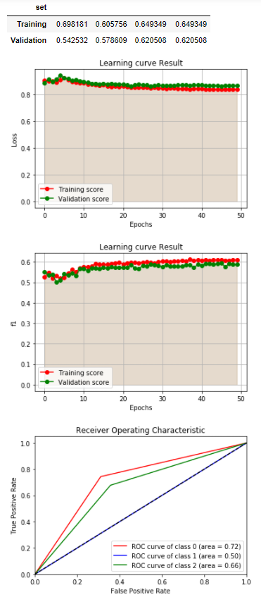   *Test 24* |

---

## Individual LSTM/GRU Networks with Skip Layers

Experiments were conducted using skip layers in networks containing LSTM or GRU layers. The next section presents more complex models with combinations of both types.

| No | Scheme | GC | DO | Loss (Train/Val) | Score (Train/Val) | Ep | Comments |
|----|--------|----|----|------------------|-------------------|----|----------|
| 42 | a=LSTM (80, bid), b=LSTM (80, bid), Addition (a, b), LSTM (3) | 4 | 0.2 | 0.7394/0.7416 | 0.58668/0.58299 | 42 | Good convergence, good model. |
| 43 | a=LSTM (80, bid), b=LSTM (80, bid), a=Addition (a, b), b=LSTM (80, bid), Addition (a, b), LSTM (3) | 3 | 0.2 | 0.8226/0.8220 | 0.4293/0.4281 | 35 | Low f1 score and high error. |
| 44 | a=GRU (80, bid), b=GRU (80, bid), Addition (a, b), GRU (3) | 3 | 0.2 | 0.75135/0.76209 | 0.56577/0.57006 | 47 | Good model, low score. |
| 45 | a=GRU (80, bid), b=GRU (80, bid), a=Addition (a, b), b=GRU (80, bid), Addition (a, b), GRU (3) | 3 | 0.2 | 0.8080/0.8070 | 0.48211/0.49407 | 48 | Low score, good model. |

The experiments yielded satisfactory results as seen in tests 42 and 44. More complex networks, such as those in tests 43 and 45, reduce metric performance. Ultimately, the results of these experiments are not higher than those of the previous sections.

**Generated diagrams:**

| Test 42                | Test 44                | Test 45                |
|------------------------|------------------------|------------------------|
| 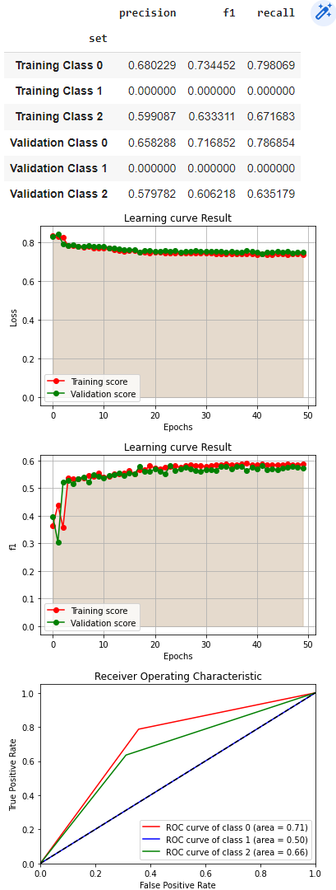   *Test 42* | 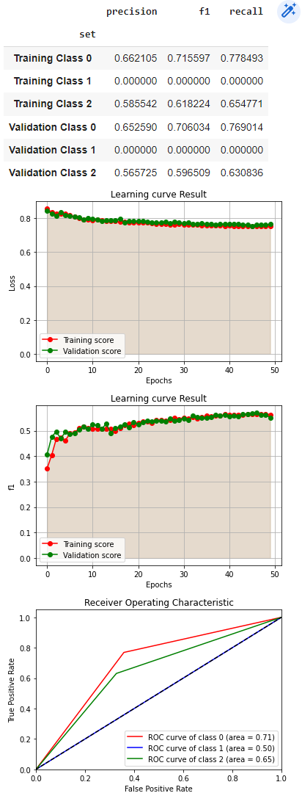   *Test 44* | 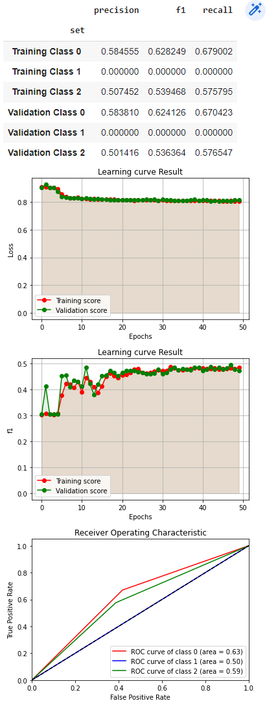   *Test45* |

---

## Combined LSTM-GRU Networks with Skip Layers

Experiments were conducted on more complex networks combining LSTM-GRU layers with skip layers. The design and metric results are shown below.

**Experiment 25:**

| Architecture | Diagram |
|-----------|-----------|
| 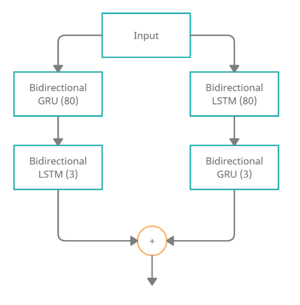 | 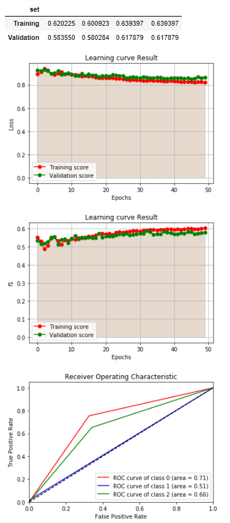 |

- Clip Gradients Norm: 2
- Dropout: 0.2
- Training Loss: 0.832539
- Validation Loss: 0.852747
- Training f1 score: 0.59584
- Validation f1 score: 0.58669
- Epoch: 38
- Im: 18

Experiment 25 shows satisfactory results. No overfitting is observed and the training is correct. However, it does not represent the best metric performance.

**Experiment 26:**

| Architecture | Diagram |
|-----------|-----------|
| 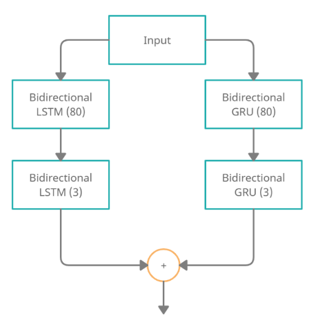 | 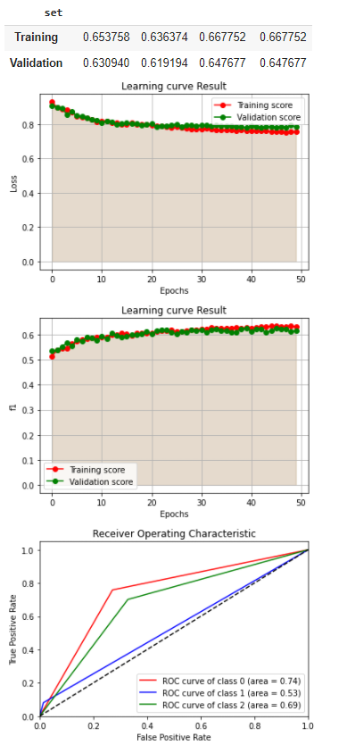 |

- Clip Gradients Norm: 2
- Dropout: 0.2
- Training Loss: 0.758902
- Validation Loss: 0.782089
- Training f1 score: 0.634616
- Validation f1 score: 0.62566
- Epoch: 43
- Im: 17

The results are also satisfactory. The learning curves converge well and the final model is efficient.

**Experiment 27:**

| Architecture |
|-----------|
| 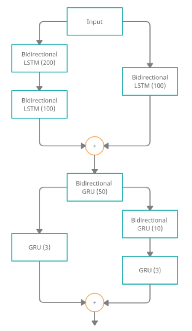 |

- Clip Gradients Norm: 2
- Dropout: 0.2
- Training Loss: 0.98942534
- Validation Loss: 0.98810594
- Training f1 score: 0.3020103
- Validation f1 score: 0.303968
- Epoch: 15
- Comments: Vanishing gradients observed.

The model exhibits the vanishing gradients phenomenon. The next experiment involves adding batch normalization to avoid this issue.

**Experiment 28 (27 + Batch Normalization):**
- Clip Gradients Norm: 2
- Dropout: 0.2
- Training Loss: 0.98796
- Validation Loss: 0.9875
- Training f1 score: 0.302010
- Validation f1 score: 0.30396
- Epoch: 39
- Comments: Initial changes in f1 value and eventual appearance of vanishing gradients.

The addition of batch normalization to the model of experiment 27 did not change the results. The model is not satisfactory.

---

## Best Model Optimization

The optimization of the best model from the above tests (test 9) is performed. Specifically, the following were used:

- **Weight balancing:** Using the `get_weights` function to address the class imbalance in the dataset. The result is a decrease in error, but also a decrease in f1 score.
- **Reset lr:** Execution of more epochs with reinitialization of the learning rate value to avoid local minima.
- **Different values of the gradient clipping norm:** The value 3 seems to bring the best results (test 34).
- **Changing the bidirectional layers to non-bidirectional:** Did not bring improvement.
- **Selection of the final hidden sequence instead of the average of the hidden sequences of the last layer for return from the network:** Led to a decrease in metric performance.
- **Ascending/descending sorted dataset:** Return of the vectorized dataset with sorted sequences according to the number of recognized embeddings to minimize padding before entering the network. The descending technique brought satisfactory results, but not the best.

**The results:**

| No | Scheme | GC | DO | Loss (Train/Val) | Score (Train/Val) | Ep | Comments |
|----|--------|----|----|------------------|-------------------|----|----------|
| 29 | 9 -> + weight balance | 1 | 0.2 | 0.75281/0.7788 | 0.52852/0.52068 | 49 | Good convergence, large fluctuation of gain but not error, better model in terms of error. |
| 30 | 29 -> + more epochs + reset LR | 1 | 0.2 | 0.745487/0.767176 | 0.587623/0.576243 | 44 | Good convergence. |
| 31 | 30 -> + more epochs + reset LR | 1 | 0.2 | 0.75936/0.7687 | 0.58129/0.5820 | 39 | Good model. |
| 32 | 31 -> + more epochs + reset LR | 1 | 0.2 | 0.75004/0.76633 | 0.587584/0.58212 | 36 | Unchanged. |
| 33 | 29 -> No reset LR | 1 | 0.2 | 0.70946/0.722208 | 0.620402/0.611640 | 100 | Optimal error so far, good model. |
| 34 | 29 -> + gradient clipping norm =3 | 3 | 0.2 | 0.70536/0.71558 | 0.62864/0.62826 | 22 | Good model, good convergence, minimal error and optimal f1 score. |
| 35 | 34 -> + return max hidden state of final layer | 3 | 0.2 | 0.75680/0.76665 | 0.3020/0.303961 | 27 | Low f1 score, appearance of vanishing gradients. |
| 36 | 34 -> +attention | 3 | 0.2 | 0.7363/0.7457 | 0.593833/0.5849 | 46 | Good model, good convergence. |
| 37 | 36 -> - bidirect lstm | 3 | 0.2 | 0.73255/0.73943 | 0.59686/0.59336 | 36 | Bad score - average error. |
| 38 | 34 -> + batch size = 8 | 3 | 0.2 | 0.69982/0.7338 | 0.64718/0.6190 | 50 | Good model, minimal deviation of curves, worse result than expected. |
| 39 | 34 -> + ascending sorted dataset for minimized padding | 3 | 0.2 | 0.7521/0.78398 | 0.3053/0.30731 | 26 | Bad score, possible bug. |
| 40 | 34 -> + descending sorted dataset for minimized padding | 3 | 0.2 | 0.6908/0.7208 | 0.62736/0.61396 | 20 | Good model, intense changes at the beginning of training. |
| 41 | 29 -> + gradient clipping = 4 | 4 | 0.2 | 0.6941/0.71384 | 0.61315/0.60482 | 47 | Good model, very good convergence. |
| 42 | 34 -> + selected last sequence per layer rather than mean of sequences | 3 | 0.2 | 0.83623/0.8396 | 0.31857/0.3168 | 15 | Low score and high error. |

**The generated diagrams:**

| Test 19                | Test 24                | Test 27                | Test 29                |
|------------------------|------------------------|------------------------|------------------------|
| 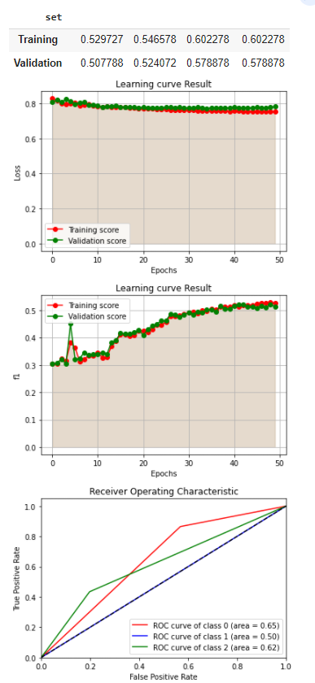   *Test 19* | 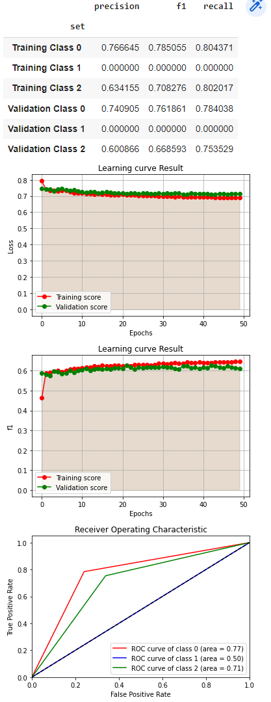   *Test 24* | 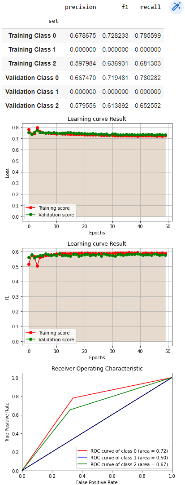   *Test 27* | 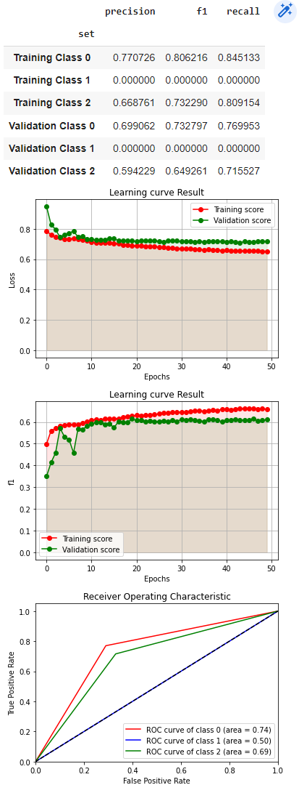   *Test 29* |

---

## Alternative Data Preprocessing

The optimal model from the above tests (test 34) is tested with alternative forms of preprocessing the dataset (P1~P8) presented in the first section. The results of the final comparisons:

| No | Model | Dimensions | Loss (Train/Val) | Score (Train/Val) | Ep | Comments |
|----|-------|------------|------------------|-------------------|----|----------|
| 1 | 34 with data preprocessing P2 | 3 | 0.2 | 0.6835/0.7110 | 0.65149/0.62560 | 39 | Good model, good convergence, high score and low error. |
| 2 | 34 with data preprocessing P3 | 3 | 0.2 | 0.7008/0.7308 | 0.63269/0.5990 | 49 | Good model, good convergence. |
| 3 | 34 with data preprocessing P5 | 3 | 0.2 | 0.67689/0.7116 | 0.65198/0.61822 | 47 | Good model, good score and error. |
| 4 | 34 with data preprocessing P6 | 3 | 0.2 | 0.6687/0.7025 | 0.6427/0.6207 | 40 | Good model, minimal deviation of curves. |
| 5 | 34 with data preprocessing P7 | 3 | 0.2 | 0.6736/0.7167 | 0.63542/0.60413 | 49 | Good model, minimal deviation of curves. |
| 6 | 34 with data preprocessing P8 | 3 | 0.2 | 0.7524/0.77130 | 0.30647/0.30545 | 24 | Low score and high error, much lower than expected. |

**Model 34 with preprocessing P1** (applied in the experiments of the above sections) shows the best performance. Experiment 34 combined with preprocessing P8 shows low results compared to the expected. The matching of the special tokens did not contribute to the differentiation of the data of each class, but rather grouped the special tokens as if they were common.

---

## Dimensionality of Embeddings

Sets of embeddings glove.6B with 300, 200, 100, 50 dimensions were tested. The best results are found in the 300-dimensional set (examined in the above sections).

**The results:**

| No | Model | Dimensions | Loss | Score | Ep | Comments |
|----|-------|------------|------|-------|----|----------|
| 1 | 34 | 200 | 0.6860/0.719 | 0.6273/0.6052 | 49 | Good model, good convergence. |
| 2 | 34 | 100 | 0.7215/0.7200 | 0.6049/0.61707 | 19 | Good model, good convergence. |
| 3 | 34 | 50 | 0.7136/0.7337 | 0.62522/0.6036 | 48 | Good model, good convergence. |

---

## Optimization of Loss Function and Optimizer

Different parameter values were tested for the Cross Entropy Loss function and the Adam optimizer. The best parameter values are presented in test 49, which has the best metric results.

**The results:**

| No | Scheme | GC | DO | Loss (Train/Val) | Score (Train/Val) | Ep | Comments |
|----|--------|----|----|------------------|-------------------|----|----------|
| 43 | 34 -> + label smoothing = 1e-4 | 3 | 0.2 | 0.6647/0.7138 | 0.6701/0.6239 | 45 | Light overfitting. |
| 44 | 34 -> + weight decay = 1e-4 | 3 | 0.2 | 0.6299/0.6581 | 0.65472/0.6388 | 23 | Good model, intense overfitting after epoch 23. |
| 45 | 34 -> + weight decay = 1e-3 | 3 | 0.2 | 0.6325/0.66047 | 0.6580/0.63918 | 28 | Good model, intense overfitting after epoch 28. |
| 46 | 34 -> + weight decay = 1e-2 | 3 | 0.2 | 0.853/0.854 | 0.30317/0.3039 | 19 | Vanishing gradients. |
| 47 | 45 -> + betas = (0.8,0.9) | 3 | 0.2 | 0.65981/0.6698 | 0.633665/0.635842 | 20 | Good model, intense overfitting after epoch 20. |
| 48 | 45 -> + betas = (0.7,0.8) | 3 | 0.2 | 0.6402/0.67552 | 0.65410/0.6328 | 25 | Good model, intense overfitting after epoch 25. |
| 49 | 47 -> + amsgrad | 3 | 0.2 | 0.6432/0.6662 | 0.65066/0.6402 | 14 | Good model, optimal f1 score and error, intense overfitting after epoch 20. |
| 50 | 49 -> + attention | 3 | 0.2 | 0.7269/0.7268 | 0.57847/0.5900 | 38 | Low score and high error. |
| 51 | 49 -> + relu | 3 | 0.2 | 0.6368/0.6945 | 0.6709/0.6148 | 25 | Appearance of overfitting in low score and high error. |

---

## Adding Attention

The addition of the attention routine reduced the metric results while increasing the error, according to test 50. The combined information of the balanced result of the hidden states provided by the attention and the result of each recurrent layer reduced the performance. Possibly, the results would be ideal with simple use of the attention result and not the union with the hidden states result. Alternatively, simplifying the final representation might highlight the functionality of the attention. One bidirectional layer has twice the length of a simple one, and with the addition of attention, the size quadruples.

Ultimately, the addition of the attention routine to this specific problem does not contribute to its solution.

---

| Without Attention                                   | With Attention                                   |
|----------------------------------------------|---------------------------------------------|
|  | 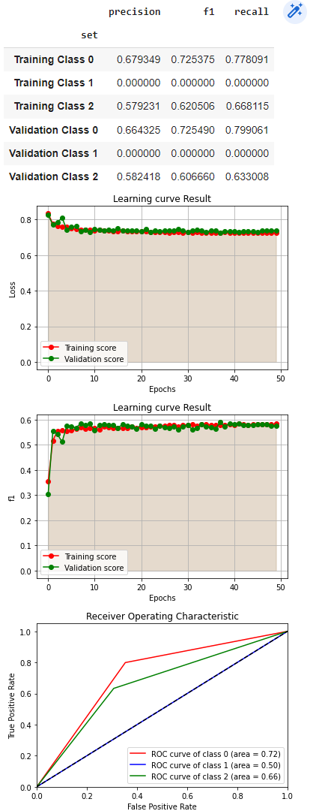

## The Final Model

The final model selected is presented in test 49 and has the best performance on the evaluated metrics. Its learning diagrams are presented below:

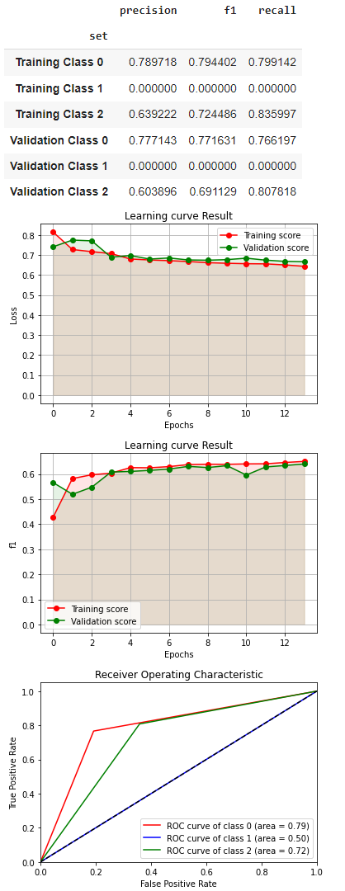

**Observations:**
- There is very good convergence in the model, avoidance of the overfitting phenomenon, and a better description of the model from the ROC curves.
- Specifically, the model stops the training process at the right moment, where either the cost difference between training and validation is avoided, or the results stagnate.

---

It is observed that the amount of true positive predictions is constantly much larger than the false positive predictions. The result curves tend towards the top left corner, which describes the ideal model. The area between the curves and the diagonal gives satisfactory results, as expected, except for class 1. For class 1, the results are inferior to the other classes, which is expected since the records classified in class 1 constitute only 15% of the dataset, showing imbalance.

Additionally, the model shows low performance in the precision metric compared to the recall metric. This indicates the presence of more false positives than false negatives. The main reason for this problem is the poor learning of the class 1 samples, as many samples are incorrectly classified as members of class 0 or class 2. Addressing this imbalance could potentially enhance the precision metric results, and consequently, the learning in class 1 and the overall network performance.

---

## Addressing Class Imbalance

The dataset faces severe imbalance in the classes. Specifically, the samples of class 1 are much fewer than the others, creating learning problems. The application of weights during the cross-entropy loss function tends to address this problem. As a result, there was a decrease in error, but the performance of the metrics and the ROC curve for class 1 did not change, maintaining weak results. An alternative solution for managing the data imbalance is the data augmentation method, which was not tested.

---

## Comparison with the DNN Model from Assignment 2

Below is the performance of the models on the dataset:

| RNN model | DNN model |
|-----------|-----------|
|  |  |

Obviously, the best results are presented by the DNN-Embeddings model from Assignment 2. At first thought, a more complex system like the recurrent neural network used should adapt better to the problem data and produce better results. Despite multiple tests, this is not achieved, while many factors may influence this outcome, such as:
- The problem may be better suited to a simpler (multinomial logistic regression/DNN) or more complex (BERT) model, than the model of this assignment.
- The model of the assignment may require a more robust system for optimizing class balance to prove its dynamicity.